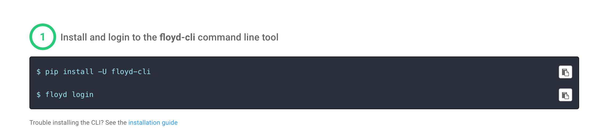
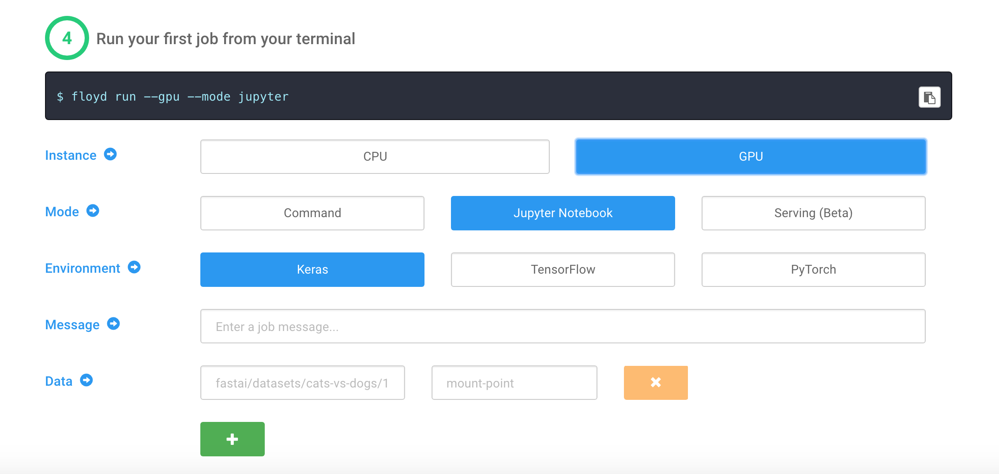
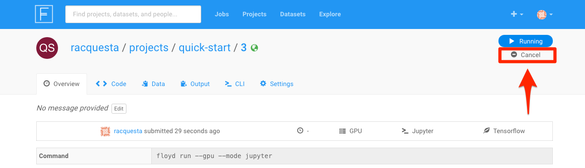

# Floydhub Installation Instructions

* Create a free account at [floydhub.com](https://www.floydhub.com)

* Install the cli and login

* Follow the prompts to authenticate the account

* Initialize a project called `quick-start` (or use whatever project name that you would like).

* Create a Keras GPU environment for Jupyter

* Shut down this server before continuing.

